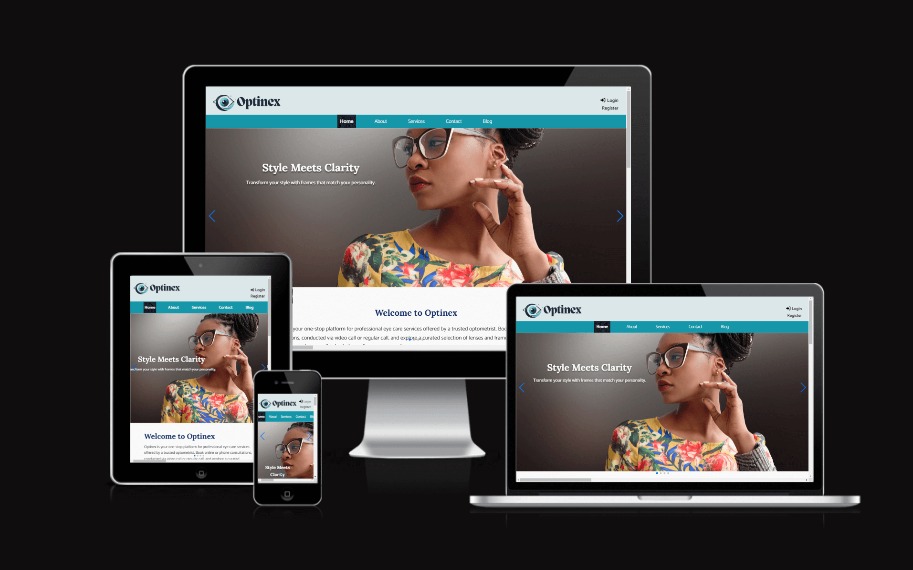

# **Optinex**

**Optinex** is an online eye clinic platform designed to provide users with seamless access to professional optometric services. The application allows users to book appointments, participate in secure online consultations, and explore articles and tips about eye care. Developed using Django, the project incorporates responsive design, dynamic functionality, and a secure user management system.

Live site: [Optinex](https://optinex-app-54aa0b5e372a.herokuapp.com/)

For **Admin access** with relevant sign-in information, click [here](https://optinex-app-54aa0b5e372a.herokuapp.com/admin/).

GitHub repository, click [here](https://github.com/easybulb/optinex).

---

## Table of Contents
1. [Introduction](#introduction)
2. [Overview](#overview)
3. [UX - User Experience](#ux---user-experience)
   - [Design Inspiration](#design-inspiration)
   - [Colour Scheme](#colour-scheme)
   - [Font](#font)
4. [Features](#features)
   - [User View - Registered/Unregistered](#user-view---registeredunregistered)
   - [Appointment Booking System](#appointment-booking-system)
   - [Online Consultation](#online-consultation)
   - [Profile Management](#profile-management)
   - [Blog Section](#blog-section)
   - [Security Features](#security-features)
5. [Future Features](#future-features)
6. [Technologies & Languages Used](#technologies--languages-used)
7. [Libraries & Frameworks](#libraries--frameworks)
8. [Tools & Programs](#tools--programs)
9. [Deployment](#deployment)
10. [Testing](#testing)
11. [Privacy Policy](#privacy-policy)
12. [Credits](#credits)

---

## Overview
Optinex is a comprehensive platform that offers:
- An intuitive interface for appointment scheduling.
- Secure online consultations.
- Articles and blogs to educate users about eye care.
- A role-based system for patients and admins.
- Responsive design to ensure compatibility across devices.

The platform aims to simplify access to optometric services and provide educational resources to promote eye health.

---

## UX - User Experience

### Design Inspiration
This was a job I did for a client and we agreed I can share the code on github. The idea for Optinex stemmed from the growing need for accessible healthcare solutions. Inspired by platforms like Zocdoc and WebMD, the application integrates professional services with educational resources to empower users to take control of their eye health.

### Colour Scheme
In line with the healthcare theme, the following colors were chosen:
- **Primary Color:** #007BFF (Calm Blue)
- **Secondary Color:** #28A745 (Health Green)
- **Background:** #FFFFFF (White)
- **Text:** #333333 (Dark Gray)

### Font
- **Headers and Logo:** Lora
- **Body Text:** Catamaran

---

## Features

### User View - Registered/Unregistered
- **Unregistered Users:** Can browse the homepage, read blog articles, and view information about services.
- **Registered Users:** Gain access to appointment booking, online consultations, and personalized profiles.

### Appointment Booking System
- **Interactive Calendar:** Users can select a date and time for their appointments.
- **Confirmation Notifications:** Users receive appointment details upon booking.
- **Admin Management:** Admins can view, approve, or reschedule appointments.

### Online Consultation
- **Secure Video/Chat Feature:** Users can consult with the optometrist directly through the platform.
- **Payment Integration:** Online consultations are tied to a payment system to streamline the process (to be implemented in future updates).

### Profile Management
- **Patient Profiles:** Users can view and update their personal information.
- **Admin Dashboard:** Admins can manage user accounts and view system metrics.

### Blog Section
- **Articles and Tips:** Users can read educational content about eye care.
- **Admin Management:** Admins can create, edit, and delete blog posts.

### Security Features
- CSRF protection for all forms.
- Password encryption using Django’s built-in authentication system.
- Role-based access control to restrict sensitive features to authorized users.

---

## Future Features
- Integration of a payment gateway for paid consultations.
- Push notifications for appointment reminders.
- AI-powered recommendations for eye care based on user profiles.

---

## Technologies & Languages Used
- **HTML5** - For structuring the web pages.
- **CSS3** - For styling and layout design.
- **JavaScript** - For interactivity and DOM manipulation.
- **Python** - Django framework for backend logic.
- **PostgreSQL** - For database management.
- **Cloudinary** - For storing and serving images.

---

## Libraries & Frameworks
- **Django** - Backend framework for development.
- **Bootstrap** - For responsive design.
- **Django Allauth** - For authentication management.
- **Crispy Forms** - For enhanced form rendering.

---

## Tools & Programs
- **Visual Studio Code** - IDE for development.
- **GitHub** - Version control.
- **Heroku** - Deployment platform.
- **Balsamiq** - For wireframe creation.

---

## Deployment
Optinex was deployed using Heroku. The steps for deployment are:
1. Set up the project locally and push to GitHub.
2. Create a new Heroku app and link it to the GitHub repository.
3. Configure environment variables for sensitive data.
4. Deploy the project and ensure all static files are collected.

---

## Testing
### Validation Testing
- **HTML** and **CSS** code were validated using W3C tools.
- Python code was tested using PEP8 standards.

### User Testing
- Tested on Chrome, Firefox, Safari, and Edge browsers.
- Responsive tests conducted on mobile, tablet, and desktop devices.

---

## Privacy Policy
Optinex prioritizes user privacy:
- User data is securely stored and used solely for providing optometric services.
- No data is shared with third parties.
- Users can request deletion of their data by contacting support.

---

## Credits
### Code
- Django Documentation.
- TinyPNG
- Bootstrap for design components.
- VSCode
- ChatGPT
- Canva

### Media
- Icons and images sourced from Canva and Unsplash.

---

